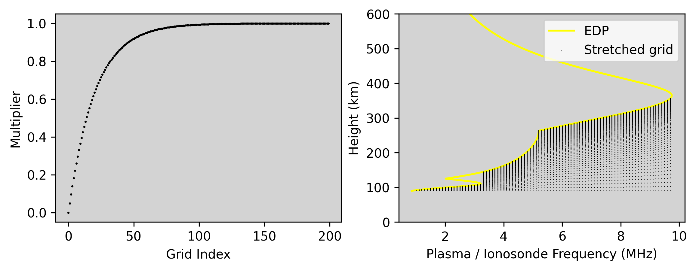
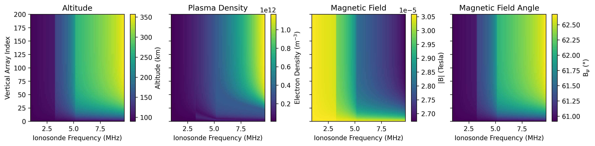
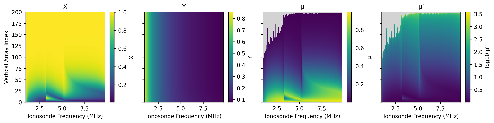
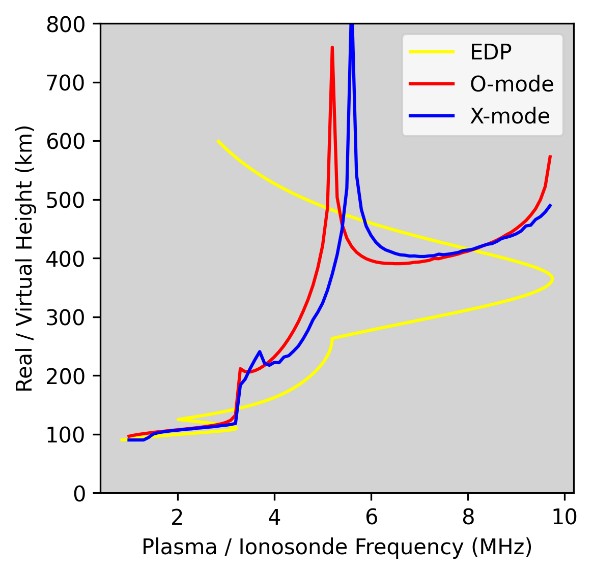
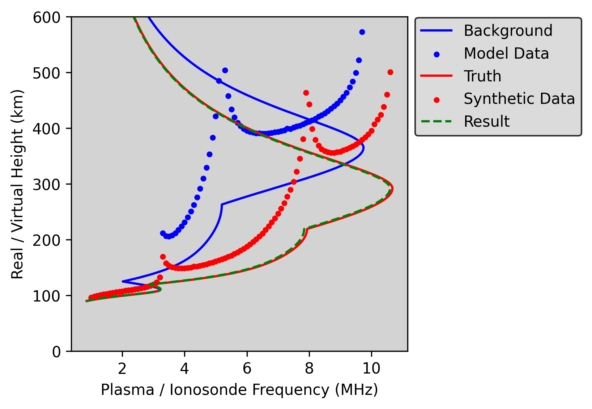
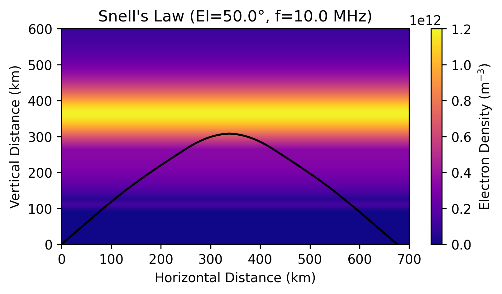
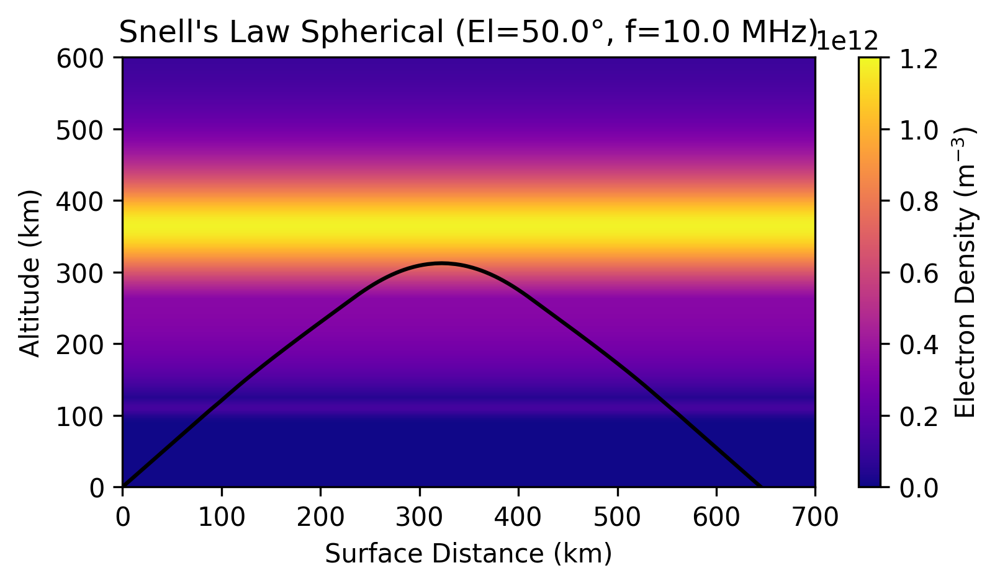
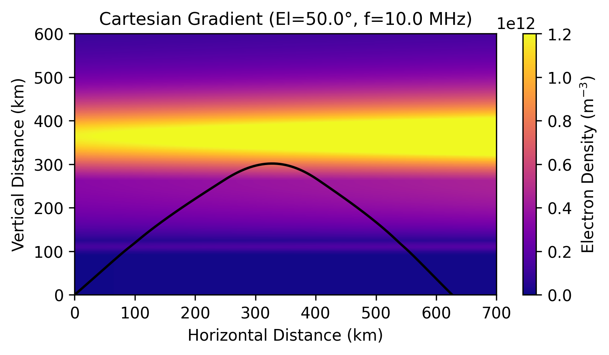
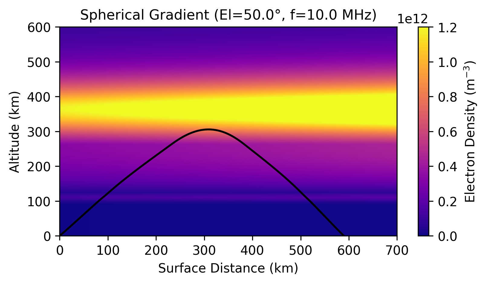

# PyRayHF (Python HF Ray Tracer for the Ionosphere)
[](https://pypi.org/project/PyRayHF/)
[](https://github.com/victoriyaforsythe/PyRayHF/actions/workflows/main.yml)
[](https://PyRayHF.readthedocs.io/en/latest/?badge=latest)
[](https://doi.org/10.5281/zenodo.15555327)
[](https://coveralls.io/github/victoriyaforsythe/PyRayHF?branch=main)

**PyRayHF** is a pure-Python package for high-frequency (HF) ionospheric ray tracing. It includes a fully magnetoionic vertical sounding module and several 2-D ray-tracing modes:

- **vertical_forward_operator** — fully magnetoionic vertical ray tracer that computes **virtual heights** for upward-propagating rays in the ordinary (O) and extraordinary (X) modes. *Key advantage:* computes virtual heights **simultaneously** for all specified ionosonde frequencies.

- **trace_ray_cartesian_stratified** — Cartesian tracer in `(x, z)` for **horizontally stratified** media (`n = n(z)`). Applies Snell’s law in flat-Earth layers. Returns the **ground intercept**, **path**, **group delay**, and **path length**. *Key advantage:* fastest baseline for local studies and unit tests; simple and robust.

- **trace_ray_cartesian_gradient** — gradient-aware Cartesian `(x, z)` tracer for **horizontally varying** media `n(x,z)`. Uses the isotropic gradient form `d/ds(n v) = grad n`. Returns the **flat-Earth ground intercept**, **path**, and optional **group delay**. *Key caveat:* flat-Earth geometry slightly **overestimates range** compared to spherical tracers.

- **trace_ray_spherical_stratified** — classical Snell’s-law path on a **spherical Earth** with stratified ionosphere (`n = n(r)`). Builds `mu(z)` for geometry and `mup(z)` for timing, then applies Snell’s law in spherical shells. Returns **ground range**, **apex altitude**, **group delay**, **group path length**, and **midpoint location**. *Key advantage:* extremely fast and numerically robust—ideal for frequency/elevation sweeps and DA inner loops.

- **trace_ray_spherical_gradient** — spherical `(r, phi)` tracer for **horizontally varying** media `n(r,phi)`, using `mu(r,phi)` for geometry (and `mup` for group delay). Returns **ground range**, **apex altitude**, **group delay**, and **landing elevation**. *Key advantage:* captures first-order horizontal gradients with only a modest cost increase over the stratified spherical case; well suited as a fast forward model for oblique-path DA.


# Installation

PyRayHF can be installed from PyPI, which will handle all dependencies:

```
pip install PyRayHF
```

Alternatively, you can clone and install it from GitHub:

```
git clone https://github.com/victoriyaforsythe/PyRayHF.git
cd PyRayHF
pip install .
```

See the documentation for details about the required dependencies.

# Example Workflow

1. Provide input arrays for a single vertical ionospheric profile, where `den`, `bmag`, `bpsi`, and `alt` are arrays of the same length representing, respectively, electron density in `m^-3`, magnetic-field strength in Tesla, magnetic-field angle to the vertical in degrees, and altitude in km. Provide an array of frequencies `freq` at which to sample this profile; these will be the HF sounder frequencies.

Below are the input arrays generated by PyIRI in `Example_Generate_Input_Arrays`.

<div align="center">
  
</div>


2. Compute the virtual height for the ordinary (`'O'`) propagation mode. A low number of vertical grid points is sufficient for O-mode (e.g., 200).

```python
# Generate array of frequencies used by a vertical ionosonde in MHz.
f_min = 0.1
f_max = 17.5
df = 0.1
ionosonde_frequency = np.arange(f_min, f_max, df)

mode = 'O'
n_points = 200
vh_O = PyRayHF.library.vertical_forward_operator(
    ionosonde_frequency,
    input_arrays['den'],
    input_arrays['bmag'],
    input_arrays['bpsi'],
    input_arrays['alt'],
    mode,
    n_points
)
```

3. Compute the virtual height for the extraordinary (`'X'`) propagation mode. A high number of vertical grid points is recommended for X-mode (e.g., 20,000), since the result may be noisy at low resolution.

```python
mode = 'X'
n_points = 20000
vh_X = PyRayHF.library.vertical_forward_operator(
    ionosonde_frequency,
    input_arrays['den'],
    input_arrays['bmag'],
    input_arrays['bpsi'],
    input_arrays['alt'],
    mode,
    n_points
)
```


# Virtual Height Calculation Overview

The virtual height is the apparent reflection height of a radio wave in the ionosphere, assuming the wave travels at the speed of light in a vacuum. In reality, the wave slows down due to the ionospheric plasma, and this effect is captured using the group refractive index.

To compute the virtual height, we integrate the group refractive index over the real-height profile. This process uses several physical quantities, all of which can be derived from models or measurements:

- **Electron density** — used to compute the plasma frequency; this is the primary factor affecting wave propagation.  
- **Magnetic-field strength** — needed to calculate the gyrofrequency, which affects how the wave interacts with the ionized medium.  
- **Magnetic-field angle** — the angle between the wave vector and the local vertical (same as wave vector for vertical case), which influences wave polarization and refraction.

Using these parameters, we compute:

- **X** — the ratio of plasma-frequency squared to wave-frequency squared, which determines how strongly the plasma affects propagation.  
- **Y** — the ratio of gyrofrequency to wave frequency, capturing the influence of the magnetic field.  
- **Refractive index (`mu`)** — describes how much the wave is slowed by the medium.  
- **Group refractive index (`mu_prime`)** — describes wave-packet propagation and is derived from the refractive index.

Once the group refractive-index profile is known, it is integrated over the height range of interest to obtain the virtual height. This value corresponds to the height at which the wave would appear to reflect if it were traveling through a vacuum.

# Why a Stretched Grid Is Needed

In standard numerical modeling, it is common to use a uniform vertical grid with points evenly spaced in altitude. However, when calculating virtual height in the ionosphere, this approach can lead to poor resolution near the reflection height.

The reflection height is the point where the radio wave slows dramatically and turns back due to the changing refractive index. Around this region, the group refractive index varies rapidly with altitude, and most of the contribution to the virtual-height integral comes from this narrow layer.

A uniform grid may not have enough points in this critical region, resulting in large numerical errors and an inaccurate estimate of the virtual height. This is especially problematic when the wave frequency is close to the local plasma frequency, where the integrand becomes sharply peaked.

To solve this, we use a **stretched vertical grid**. This grid places more points near the reflection region and fewer points in regions where the variation is smooth. By concentrating resolution where it is most needed, the stretched grid ensures accurate integration of the group refractive index while keeping the total number of points manageable. This approach improves both efficiency and precision, making it ideal for ionospheric ray tracing and virtual-height modeling.

# Grid Construction for Virtual Height Calculation

For each ionosonde frequency, we interpolate the **electron-density profile (EDP)**—converted into **plasma frequency**—to determine the height at which the ionosonde frequency equals the local plasma frequency (for O-mode, and X + Y = 1 condition for X-mode). This height is the **reflection height**, and it marks the upper boundary for the integration in the virtual-height calculation.

Once the reflection height is known, we construct a new vertical grid tailored to that specific frequency. This is achieved using a **stretched-grid function** that varies smoothly from 0 to 1. The function concentrates points near the top of the grid—close to the reflection height—where resolution is most critical.

We apply this function by multiplying it by the altitude range of interest: from the **minimum altitude** (e.g., 80 km) to the **reflection height**. This results in a **resampled array of altitudes** with a fixed number of points, `N_points`.

The figures below show the multiplier obtained from the **stretched-grid function** and the locations of the new stretched grid relative to the reflection height for each ionosonde frequency, plotted on the same x-axis as the plasma frequency. This new grid ensures fine resolution near the reflection height while minimizing unnecessary points at lower altitudes.

<div align="center">
  
</div>

By repeating this process for each ionosonde frequency, we form a 2D matrix of altitudes with dimensions `[N_frequency, N_points]`. At this stage, we **interpolate all input parameters**—such as electron density, magnetic-field strength, and magnetic-field angle—onto this new grid. This ensures that every virtual-height calculation uses accurately aligned input data, matched to the specific resolution needs of the ray path at that frequency.

The following figures present the input data converted into 2D arrays, where the x-axis represents ionosonde frequency and the y-axis corresponds to the vertical grid index of size `N_points`. The first figure displays the altitude of each grid point. The subsequent figures show the interpolated plasma density, magnetic-field strength, and magnetic-field angle.

<div align="center">
  
</div>

The next figures present the computed **X**, **Y**, **refractive index (`mu`)**, and **group refractive index (`mu_prime`)** parameters for O-mode.

<div align="center">
  
</div>

The **group refractive index (`mu_prime`)** is multiplied by a matrix containing the distances between grid points and summed over the vertical axis to obtain the virtual height, shown by the red curves in the figure below.

<div align="center">
  
</div>

See the [tutorials](https://github.com/victoriyaforsythe/PyRayHF/tree/main/docs/tutorials) folder for more detailed examples.

# Example: Compute and Fit Virtual Heights Using PyRayHF

This example demonstrates how to compute ionospheric virtual heights using the PyRayHF library and perform parameter inversion to fit synthetic observations.

**Workflow Overview**

1) **Load input arrays.** Load a set of pre-generated ionospheric input arrays from `Example_input.p`, created using the PyIRI library (see the [tutorials](https://github.com/victoriyaforsythe/PyRayHF/tree/main/docs/tutorials)).  
2) **Generate a background model.** Compute the virtual height (`vh_back`) and electron-density profile (`EDP_back`) for the ordinary (`'O'`) mode using `model_VH`. This serves as the background for later minimization.  
3) **Create synthetic observations.** Simulate a “truth” scenario by modifying the F2-layer parameters (increase peak density by 20%, lower peak height by 20%, and increase bottomside thickness by 10%). Generate corresponding virtual heights and electron densities using the same `model_VH` function.  
4) **Preprocess observations.** Filter out any `NaN` values from the synthetic virtual-height data to ensure the minimization function runs properly.  
5) **Minimize and fit parameters.** Use `minimize_parameters` with brute-force optimization to find F2-layer parameters that best reproduce the synthetic virtual-height observations. The method searches over a range of values with a 30% perturbation margin and a step size of 1 km.

<div align="center">
  
</div>

The notebook for this example can be found in the [tutorials](https://github.com/victoriyaforsythe/PyRayHF/tree/main/docs/tutorials) folder.


# Example: 2-D Cartesian Snell's Law Raytracer

This function models how a high-frequency radio wave propagates through the ionosphere, using Snell’s law adapted for a plasma medium. It calculates the trajectory of the ray as it leaves the ground, bends through the ionized plasma, reaches a turning point, and (if conditions allow) returns back toward Earth.

**Background: Snell’s Law in a Plasma.**
In a uniform dielectric, Snell’s law states that `nsinθ=constant`, where `n` is the refractive index and `θ` is the propagation angle relative to the vertical. In a plasma, the refractive index isn’t constant but depends on: electron density (affects plasma frequency), magnetic field (splits O and X modes), wave frequency, and angle between wave vector and magnetic field. This gives two possible wave modes: the ordinary (O) and extraordinary (X) mode, each with a different effective refractive index. The function uses auxiliary functions `find_X`, `find_Y`, and `find_mu_mup` to compute these refractive indices as functions of altitude. Thus, the plasma-modified Snell’s law is applied:
`μ′sinθ=constant`, where `μ′` is the **transverse refractive index** for the chosen wave mode.

<div align="center">
  
</div>

The notebook for this example can be found in the [tutorials](https://github.com/victoriyaforsythe/PyRayHF/tree/main/docs/tutorials) folder.

# Example: 2-D Spherical Snell's Law Raytracer

This function extends the 2-D Cartesian raytracer to a spherical Earth–ionosphere geometry, where curvature and variable refractive index with altitude both affect the ray path. It models how a high-frequency radio wave travels through a stratified, magnetized ionosphere, applying Snell’s law in a medium whose refractive properties vary continuously with radial distance from Earth’s center.

**Background: Snell’s Law in Spherical Coordinates.**
In a spherical system, the conserved quantity derived from Snell’s law becomes
`μ′r sinθ = constant`,
where `r` is the radial distance from Earth’s center, `θ` is the local zenith angle, and `μ′` is the transverse refractive index for the selected wave mode (O or X). This formulation ensures the ray bends smoothly in response to plasma gradients while respecting Earth’s curvature.

The function numerically integrates the ray’s trajectory through successive altitude layers, updating the refractive index via `find_X`, `find_Y`, and `find_mu_mup`. It determines the turning point (where the refractive index causes total reflection) and mirrors the trajectory in `(φ, z)` to model the down-leg, producing a complete path from launch to return.

<div align="center">
  
</div>

The notebook for this example can be found in the [tutorials](https://github.com/victoriyaforsythe/PyRayHF/tree/main/docs/tutorials) folder.

# Example: 2-D Cartesian Gradient Raytracer

This function simulates high-frequency radio wave propagation in a 2-D Cartesian ionosphere where the refractive index varies continuously with altitude, rather than in discrete layers. It solves the ray path by integrating the local refractive index gradient directly, providing a smooth model of how the ray bends through a stratified plasma.

**Background: Refractive Index Gradient Method.**
Instead of enforcing Snell’s law between distinct layers `(μ′ sinθ = constant)`, the gradient approach uses the differential form of ray tracing:
`dθ/dz = -(1/μ′) (dμ′/dz) tanθ`,
which relates changes in propagation angle to the vertical gradient of the refractive index. This captures subtle curvature and bending that arise in a smoothly varying medium—especially important when electron density changes gradually with altitude.
The function calculates the refractive index profile from plasma parameters using `find_X`, `find_Y`, and `find_mu_mup`, then integrates the trajectory step-by-step through the medium. It determines the turning point (where total reflection would occur) and traces the ray down the Earth without mirrowing the path. This produces a high-resolution model of ionospheric refraction without relying on piecewise Snell’s-law approximations.

<div align="center">
  
</div>

The notebook for this example can be found in the [tutorials](https://github.com/victoriyaforsythe/PyRayHF/tree/main/docs/tutorials) folder.

# Example: 2-D Spherical Gradient Raytracer

This function models high-frequency radio wave propagation in a spherical Earth–ionosphere system using a continuously varying refractive index. It numerically integrates the ray equations through a stratified plasma, accounting for both Earth’s curvature and the smooth vertical and horizontal gradients of ionospheric parameters.

**Background: Ray Tracing in Spherical Geometry.**
In spherical coordinates, Snell’s law takes the form
`μ′ r sinθ = constant`
for discrete layers. When the refractive index varies continuously, this constant relationship is replaced by its differential form, where the angular change of the ray depends on the local refractive index gradient and geometry. The result is a gradual bending of the ray path governed by both the plasma structure and Earth’s curvature.
The function computes the refractive index profile at each altitude using `find_X`, `find_Y`, and `find_mu_mup`, then integrates the coupled differential equations for radial distance `r` and angle `θ`. It determines the turning point (where total reflection occurs) and traces the ray back toward Earth without mirroring the path, producing a complete up- and down-leg trajectory in the `(φ, z)` plane.

<div align="center">
  
</div>


The notebook for this example can be found in the [tutorials](https://github.com/victoriyaforsythe/PyRayHF/tree/main/docs/tutorials) folder.
