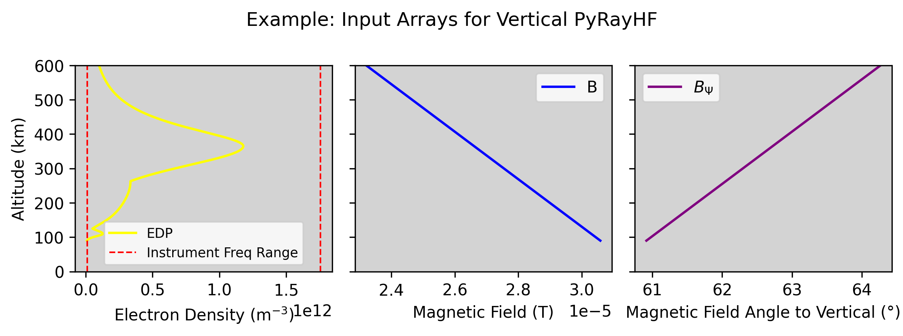

# PyRAY (Python HF Ray Tracer for the Ionosphere)
[](https://pypi.org/project/PyRAY/)
[](https://github.com/victoriyaforsythe/PyRAY/actions/workflows/main.yml)
[](https://PyRAY.readthedocs.io/en/latest/?badge=latest)
[](https://doi.org/10.5281/zenodo.8235173)

PyRAY is a Python-based software package for analytic HF raytracing through the ionosphere.

For a given electron density profile and the magnetic field it calculates virtual heights for the upward-propagating HF rays in ordinary (O) and extraodinary (X) modes.

A key advantage of PyRAY is its efficiency: it calculater the virtual heigh simultaneousely for all given ionosonde freqeuncies.


# Installation

PyRAY can be installed from PyPI, which will handle all dependencies:

```
pip install PyRAY
```

Alternatively, you can clone and install it from GitHub:

```
git clone https://github.com/victoriyaforsythe/PyRAY.git
cd PyRAY
python -m build .
pip install .
```

See the documentation for details about the required dependencies.

# Example Workflow

1. Provide input arrays for one vertical ionospheric profile, where $den$, $bmag$, $bpsi$, and $alt$ are the arrays of the same length, referring to electron density in m$^{-3}$, strength of the magnetic field in Tesla, angle of the magnetic field to the vertical in degrees, altitude in km.
Provide the array of frequencies $freq$ at which you would like to sample this profile, that will be the frequencies of the HF sounder.

Below are the input arrays generated by PyIRI in Example_Generate_Input_Arrays.



2. Compute virtual height for the ordinary 'O' propagation mode. A low number
of vertical grid points is sufficient for O-mode (e.g., 200).

```
mode = 'O'
n_points = 200
vh_O = PyRAY.library.virtical_forward_operator(input_arrays['freq'],
                                            input_arrays['den'],
                                            input_arrays['bmag'],
                                            input_arrays['bpsi'],
                                            input_arrays['alt'],
                                            mode,
                                            n_points)
```

3. Compute virtual height for the extraordinary 'X' propagation mode.
A high number of vertical grid points is recommended for X-mode (e.g., 20000),
since the result may be noisy at low resolution.

```
mode = 'X'
n_points = 20000
vh_X = PyRAY.library.virtical_forward_operator(input_arrays['freq'],
                                            input_arrays['den'],
                                            input_arrays['bmag'],
                                            input_arrays['bpsi'],
                                            input_arrays['alt'],
                                            mode,
                                            n_points)
```


# Learn More

See the [tutorials](https://github.com/victoriyaforsythe/PyRAY/tree/main/docs/tutorials) folder for mode detailed examples.
