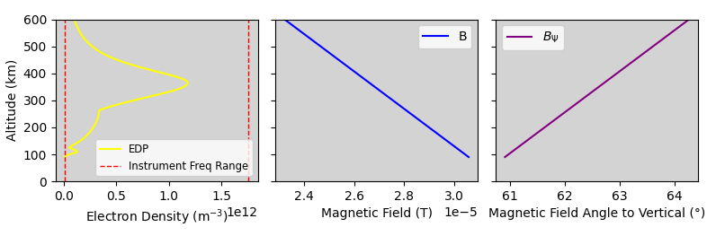

Example: Generate Input Arrays Using PyIRI 
============================================

1. Import libraries.

::

    import datetime
    import pickle

    import numpy as np
    import matplotlib.pyplot as plt

    import PyIRI
    import PyRayHF

2. Select the day and Universal Time of interest.

::

    year = 2020
    month = 4
    day = 1
    UT = 10.0

3. Provide the F10.7 value for this day. You can look it up at OMNIWeb:
https://omniweb.gsfc.nasa.gov/form/dx1.html

::

    F107 = 69.4

4. Create datetime object for the selected day.

::

    dtime_day = datetime.datetime(year, month, day)
    # Find decimal year for IGRF input
    decimal_year = PyIRI.main_library.decimal_year(dtime_day)

5. Define geographic location (longitude, latitude in degrees)

::

    lon = 10.0
    lat = 0.0

6. Create an array of altitudes (km).

::

    aalt = np.arange(90., 600., 1.)

7. Run PyIRI for the selected time and location.

::

    (F2, F1, E, _, _, _, 
    edp) = PyIRI.edp_update.IRI_density_1day(year,
                                            month,
                                            day,
                                            np.array([UT]),
                                            np.array([lon]),
                                            np.array([lat]),
                                            aalt,
                                            F107,
                                            PyIRI.coeff_dir,
                                            ccir_or_ursi=1)

8. Extract 1-D electron density profile

::

    den = edp[0, :, 0]

9. Compute magnetic inclination and field strength at min and max altitudes.

::

    (inc_min, _, _, _, _, _,
    bmag_min) = PyIRI.igrf_library.inclination(PyIRI.coeff_dir,
                                                decimal_year,
                                                np.array([lon]),
                                                np.array([lat]),
                                                np.min(aalt),
                                                only_inc=False)

    (inc_max, _, _, _, _, _,
    bmag_max) = PyIRI.igrf_library.inclination(PyIRI.coeff_dir,
                                                decimal_year,
                                                np.array([lon]),
                                                np.array([lat]),
                                                np.max(aalt),
                                                only_inc=False)

10. Compute angles between the magnetic field and vertical ray.

::

    bpsi_min = PyRayHF.library.vertical_to_magnetic_angle(inc_min[0])
    bpsi_max = PyRayHF.library.vertical_to_magnetic_angle(inc_max[0])

11. Construct array of angles (°) between magnetic field and vertical ray.

::

    abpsi = np.linspace(bpsi_min, bpsi_max, aalt.size)

12. Construct array of magnetic field strengths in Tesla (IGRF outputs nT).

::

    abmag = np.linspace(bmag_min[0], bmag_max[0], aalt.size) / 1e9

13. Generate array of frequencies used by a vertical ionosonde (Hz).

::

    ionosonde_frequency = np.arange(1e6,
                                    PyRayHF.library.den2freq(np.max(den)),
                                    0.1e6)

14. Combine inputs into a dictionary.

::

    input_example = {'den': den,
                     'alt': aalt,
                     'bmag': abmag,
                     'bpsi': abpsi,
                     'freq': ionosonde_frequency,
                     'F2': F2,
                     'F1': F1,
                     'E': E}

1.  Save inputs to a pickle file

::

    file_save = 'Example_input.p'
    pickle.dump(input_example, open(file_save, "wb"))

