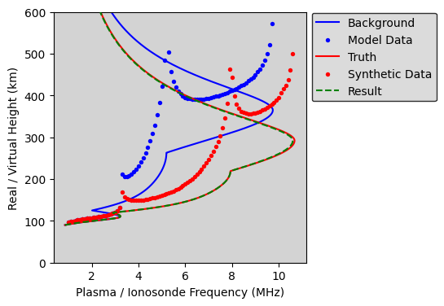

Example: Minimization Tool in PyRayHF
=====================================

1. Import libraries.

::

    import pickle
    from copy import deepcopy

    import numpy as np
    import matplotlib.pyplot as plt

    import PyRayHF

2. Load input arrays from the example.
See Example_Generate_Input_Arrays for how to create input arrays using PyIRI.

::

    file_open = 'Example_input.p'
    input_example = pickle.load(open(file_open, 'rb'))

3. Compute virtual height for the ordinary 'O' propagation mode.
A low number of vertical grid points is sufficient for O-mode (e.g., 200).
Consider this the model background for the upcoming minimization.

::

    mode = 'O'
    n_points = 200

    # Produce background data, or the observations expected by the background
    vh_back, EDP_back = PyRayHF.library.model_VH(input_example['F2'],
                                                 input_example['F1'],
                                                 input_example['E'],
                                                 input_example['freq'],
                                                 input_example['alt'],
                                                 input_example['bmag'],
                                                 input_example['bpsi'])

4. Create a known "truth" by modifying the background parameters:
increase Nm by 20%, decrease hm by 20%, and increase B_bot by 10%.
This generates synthetic data. Note that the F1 layer depends on F2 
and will change accordingly.

::

    F2_truth = deepcopy(input_example['F2'])
    F2_truth['Nm'] = F2_truth['Nm'] * 1.2
    F2_truth['hm'] = F2_truth['hm'] * 0.8
    F2_truth['B_bot'] = F2_truth['B_bot'] * 1.1
    vh_data, EDP_truth = PyRayHF.library.model_VH(F2_truth,
                                                  input_example['F1'],
                                                  input_example['E'],
                                                  input_example['freq'],
                                                  input_example['alt'],
                                                  input_example['bmag'],
                                                  input_example['bpsi'])

5. Filter out NaNs in the synthetic data before minimization.
Minimization will not work properly if NaNs are present.
Use only the part of the spectrum above 0.24 × NmF2.

::
    lid = np.where(np.isfinite(vh_data) == 1)[0]
    freq_in = input_example['freq'][ind_valid]
    vh_in = vh_data[ind_valid]

6. Using minimization find parameters that match the observations.

::
    (vh_result,
     EDP_result) = PyRayHF.library.minimize_parameters(input_example['F2'],
                                                       input_example['F1'],
                                                       input_example['E'],
                                                       freq_in,
                                                       vh_in,
                                                       input_example['alt'],
                                                       input_example['bmag'],
                                                       input_example['bpsi'])

7. Plot the results. The electron density profile (EDP) is converted from
plasma density to plasma frequency and plotted using real altitude on the
y-axis. Virtual heights for O-mode are plotted with ionosonde frequency on the
x-axis and virtual height on the y-axis.

