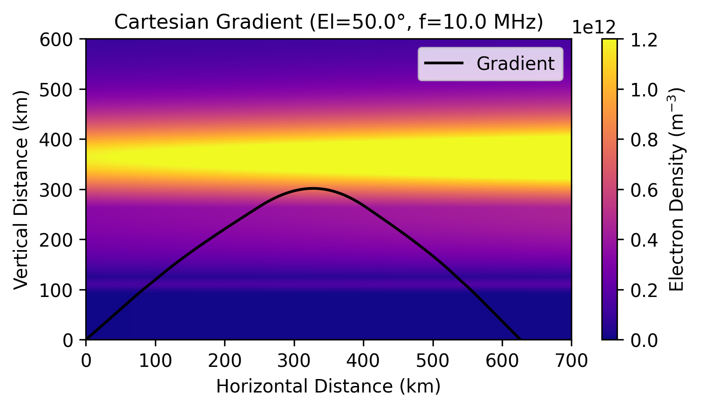

Example: PyRayHF Cartesian Gradient Raytracing
==============================================

Background: Ray Equations in a Plasma
-------------------------------------

Unlike Snell's law approaches (which assume stratification and mirror the up-leg to
construct the down-leg), the **gradient-based method** solves the full ray equations
in Cartesian geometry:

- **Ray position**: :math:`\mathbf{r} = (x, z)` [km]
- **Unit tangent vector**: :math:`\mathbf{v} = (v_x, v_z)` with :math:`\|\mathbf{v}\| = 1`
- **Arc length**: :math:`s` [km]
- **Refractive index field**: :math:`n(x, z) = \mu` (phase index)

The equations of motion are:

.. math::

   \frac{d\mathbf{r}}{ds} = \mathbf{v}

.. math::

   \frac{d\mathbf{v}}{ds} = \frac{1}{n} \left( \nabla n - (\nabla n \cdot \mathbf{v}) \mathbf{v} \right)

This form ensures that the velocity vector :math:`\mathbf{v}` remains normalized,
and the ray bends naturally according to the spatial gradients of :math:`\mu`.

Specifics in PyRayHF
--------------------

- Geometry (bending) uses the **phase index μ**
- Group delay integrates the **group index μ′** (mup) if provided via ``mup_func``
- The refractive index and its gradients are supplied by
  ``build_refractive_index_interpolator``
- Cartesian geometry assumes a **flat Earth** (no curvature effects)
- Termination conditions stop the ray when it:

  * Reaches the ground
  * Leaves the vertical or horizontal domain
  * Exceeds maximum arc length

This method is more general than Snell's law since it handles arbitrary 2D gradients,
not only stratified profiles.

How to run
----------

1. Import libraries.

::

    import numpy as np
    import pickle
    import matplotlib.pyplot as plt
    from PyRayHF.library import find_X, find_Y, find_mu_mup
    from PyRayHF.library import build_refractive_index_interpolator
    from PyRayHF.library import trace_ray_cartesian_gradient
    from scipy.interpolate import RegularGridInterpolator

2. Load input arrays from the example.
See Example_Generate_Input_Arrays for how to create input arrays using PyIRI.

::

    file_open = 'Example_input.p'
    input_arrays = pickle.load(open(file_open, 'rb'))
    alt_km = input_arrays["alt"]
    Ne = input_arrays["den"]
    Babs = input_arrays["bmag"]
    bpsi = input_arrays["bpsi"]

3. Ensure that the ground level is included:

::

    h_ground = 0
    if alt_km[0] > h_ground:
        Ne0 = np.interp(h_ground, alt_km, Ne)
        Babs0 = np.interp(h_ground, alt_km, Babs)
        bpsi0 = np.interp(h_ground, alt_km, bpsi)
        alt_km = np.insert(alt_km, 0, h_ground)
        Ne = np.insert(Ne, 0, Ne0)
        Babs = np.insert(Babs, 0, Babs0)
        bpsi = np.insert(bpsi, 0, bpsi0)

4. Add some gradient:

::

    Ne_gradient = Ne_grid * (1.0 + 0.5 * (Xg / Xg.max()))

5. Calculate plasma parameters:

::

    X = find_X(Ne_gradient, f0_Hz)
    Y = find_Y(f0_Hz, Babs_grid)

    mu, mup = find_mu_mup(X, Y, bpsi_grid, mode)
    mup = np.where((mup < 1e-3) | np.isnan(mup), np.nan, mup)
    mup0 = mup[0]

6. Build interpolators

::

    n_and_grad = build_refractive_index_interpolator(z_grid, x_grid, mu)
    mup_interp = RegularGridInterpolator((z_grid, x_grid),
                                        mup,
                                        bounds_error=False,
                                        fill_value=np.nan)
    mup_func = lambda x, z: mup_interp(np.column_stack([z, x]))

6. Raytrace:

::

    result = trace_ray_cartesian_gradient(n_and_grad=n_and_grad,
                                          x0_km=0.0,
                                          z0_km=0.0,
                                          elevation_deg=elevation_deg,
                                          s_max_km=4000.0,
                                          max_step_km=5.0,
                                          z_max_km=600.0,
                                          x_min_km=0.0,
                                          x_max_km=1000.0,
                                          mup_func=mup_func)

7. Plot the results:

::

    fig, ax = plt.subplots(1, 1)
    fig.set_size_inches(6, 3)
    ax_plot = ax
    ax_plot.set_xlim(0, 700)
    ax_plot.set_ylim(0, 600)
    ax_plot.set_facecolor("lightgray")
    ax_plot.set_ylabel('Vertical Distance (km)')
    ax_plot.set_xlabel('Horizontal Distance (km)')
    vmin = 0
    vmax = 1.2e12
    color_ticks = np.arange(vmin, vmax + 2e11, 2e11)
    pc = ax_plot.pcolormesh(Xg, Zg, Ne_gradient, shading='auto',
                            cmap='plasma', vmin=vmin, vmax=vmax)
    ax_plot.plot(result['x'], result['z'], c='black', label='Gradient')
    ax_plot.set_title(f"Cartesian Gradient (El={elevation_deg:.1f}°, f={f0_Hz/1e6} MHz)", fontsize=11)
    plt.colorbar(pc, label='Electron Density (m$^{-3}$)', ax=ax_plot,
                ticks=color_ticks)
    ax.legend()
    plt.show()

8. Print diagnostics:

::

    print('--------------------------------------------------')
    print('Cartesian gradient-based raytracing:')
    print('--------------------------------------------------')
    print('Group Path (km): ', result['group_path_km'])
    print('Group delay (sec): ', result['group_delay_sec'])
    print('Ground_ Range (km): ', result['ground_range_km'])
    print('x midpoint (km): ', result['x_midpoint'])
    print('z midpoint (km): ', result['z_midpoint'])

Cartesian gradient-based raytracing:
-------------------------------------
Group Path (km):  885.8935955316156

Group delay (sec):  0.0033971066053262392

Ground Range (km):  626.4220854230803

x midpoint (km):  355.28696968480824

z midpoint (km):  296.41432345069234