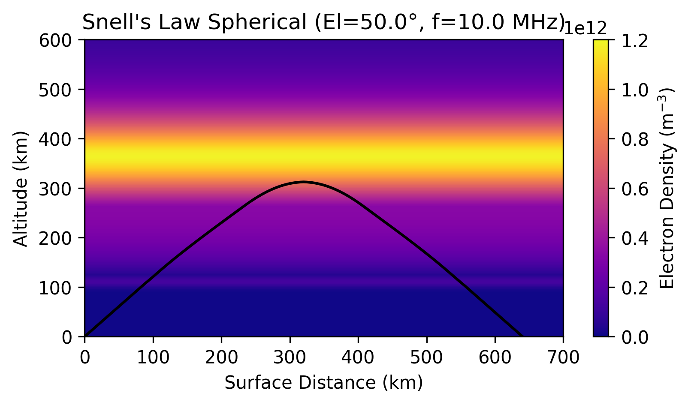

Example: PyRayHF Spherical Snell's Law Raytracing
=================================================

Background: Snell's Law in a Plasma
-----------------------------------

In a uniform dielectric, Snell's law states that

.. math::

   n \cdot \sin(\theta) = \text{constant}

where :math:`n` is the refractive index and :math:`\theta` is the propagation angle relative to the vertical.

In a plasma, however, the refractive index is not constant. It depends on:

- **Electron density** → determines the plasma frequency
- **Magnetic field strength** → splits propagation into ordinary and extraordinary modes
- **Radio frequency** of the transmitted wave
- **Angle** between the wave vector and the geomagnetic field

This results in two possible propagation modes:

- **Ordinary (O) mode**
- **Extraordinary (X) mode**

In PyRayHF, the helper functions ``find_X``, ``find_Y``, and ``find_mu_mup`` compute these indices as functions of altitude.

Thus, the plasma-modified Snell’s law is applied as

.. math::

   \mu \cdot \sin(\theta) = \text{constant}

where :math:`\mu` is the **phase refractive index** for the chosen wave mode.

Once the geometric path is determined, the **group delay** is evaluated by integrating along the trajectory using the **group refractive index** :math:`\mu'`.

---

Specifics in PyRayHF (Spherical Formulation)
--------------------------------------------

- Geometry (bending) uses the **phase index :math:`\mu`** in spherical geometry
- The Snell invariant is enforced as

  .. math::

     \mu \cdot r \cdot \sin(\theta) = \text{constant}

  where :math:`r` is the radial distance from the Earth's center
- Group delay integrates the **group index :math:`\mu'`** (mup) along the curved trajectory
- The down-leg is constructed as a **mirror of the up-leg** about the turning point (apex)
- Outputs include both spherical coordinates (central angle :math:`\psi`, altitude :math:`z`) and Cartesian-like coordinates (:math:`x, z`) for plotting convenience

---

Notes on Visualization
----------------------

- **Flat view**: x-axis = ground arc length [km], y-axis = altitude above Earth's surface [km]

How to run
----------

1. Import libraries.

::

    import numpy as np
    import pickle
    import matplotlib.pyplot as plt
    from PyRayHF.library import trace_ray_cartesian_snells

2. Load input arrays from the example.
See Example_Generate_Input_Arrays for how to create input arrays using PyIRI.

::

    file_open = 'Example_input.p'
    input_arrays = pickle.load(open(file_open, 'rb'))

    alt_km = input_arrays["alt"]
    Ne = input_arrays["den"]
    Babs = input_arrays["bmag"]
    bpsi = input_arrays["bpsi"]

3. Ensure that the ground level is included:

::

    h_ground = 0
    if alt_km[0] > h_ground:
        Ne0 = np.interp(h_ground, alt_km, Ne)
        Babs0 = np.interp(h_ground, alt_km, Babs)
        bpsi0 = np.interp(h_ground, alt_km, bpsi)
        alt_km = np.insert(alt_km, 0, h_ground)
        Ne = np.insert(Ne, 0, Ne0)
        Babs = np.insert(Babs, 0, Babs0)
        bpsi = np.insert(bpsi, 0, bpsi0)

4. Define inputs

::

    elevation_deg = 50.
    f0_Hz = 10e6
    mode = "O"

5. Trace Using Snell's Law Cartesian 2-D Raytracing

::

    result = trace_ray_cartesian_snells(f0_Hz=f0_Hz,
                                        elevation_deg=elevation_deg,
                                        alt_km=alt_km,
                                        Ne=Ne,
                                        Babs=Babs,
                                        bpsi=bpsi,
                                        mode=mode)

6. Plot the results.

::

    # Create 2D density grid (Ne assumed horizontally uniform)
    nx = 500
    xmax = np.max(result['x']) * 1.1
    x_grid = np.linspace(0, xmax, nx)
    z_grid = alt_km
    Xg, Zg = np.meshgrid(x_grid, z_grid)
    Ne_grid = np.tile(Ne[:, np.newaxis], (1, nx))

    fig, ax = plt.subplots(1, 1)
    fig.set_size_inches(6, 3)
    ax_plot = ax
    ax_plot.set_xlim(0, 700)
    ax_plot.set_ylim(0, 600)
    ax_plot.set_facecolor("lightgray")
    ax_plot.set_ylabel('Vertical Distance (km)')
    ax_plot.set_xlabel('Horizontal Distance (km)')
    vmin = 0
    vmax = 1.2e12
    color_ticks = np.arange(vmin, vmax + 2e11, 2e11)
    pc = ax_plot.pcolormesh(Xg, Zg, Ne_grid, shading='auto',
                            cmap='plasma', vmin=vmin, vmax=vmax)
    ax_plot.plot(result['x'], result['z'], c='black')
    ax_plot.set_title(f"Snell\'s Law (El={elevation_deg:.1f}°, f={f0_Hz/1e6} MHz)")
    plt.colorbar(pc, label='Electron Density (m$^{-3}$)', ax=ax_plot,
                ticks=color_ticks)
    plt.show()

7. Print diagnostics:

::

    print('--------------------------------------------------')
    print('Snell\'s Law Raytracing:')
    print('--------------------------------------------------')
    print('Group Path (km): ', result['group_path_km'])
    print('Group delay (sec): ', result['group_delay_sec'])
    print('Ground Range (km): ', result['ground_range_km'])
    print('x midpoint (km): ', result['x_midpoint'])
    print('z midpoint (km): ', result['z_midpoint'])

Spherical Snell's Law Raytracing:
---------------------------------
Group Path (km):  908.568361604233

Group delay (sec):  0.0034587029649713226

Ground Range (km):  640.1867550395866

x midpoint (km):  320.0933775197933

z midpoint (km):  312.28223436121976
