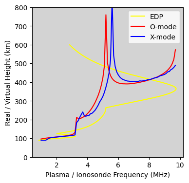

Example: Run Vertical PyRAY for O and X modes
=============================================

1. Import libraries.

::

    import pickle

    import matplotlib.pyplot as plt

    import PyRAY

2. Load input arrays from the example.
See Example_Generate_Input_Arrays for how to create input arrays using PyIRI.

::

    file_open = 'Example_input.p'
    input_arrays = pickle.load(open(file_open, 'rb'))

3. Compute virtual height for the ordinary 'O' propagation mode. A low number
of vertical grid points is sufficient for O-mode (e.g., 200).

::

    mode = 'O'
    n_points = 200
    vh_O = PyRAY.library.virtical_forward_operator(input_arrays['freq'],
                                                input_arrays['den'],
                                                input_arrays['bmag'],
                                                input_arrays['bpsi'],
                                                input_arrays['alt'],
                                                mode,
                                                n_points)

4. Compute virtual height for the extraordinary 'X' propagation mode.
A high number of vertical grid points is recommended for X-mode (e.g., 20000),
since the result may be noisy at low resolution.

::

    mode = 'X'
    n_points = 20000
    vh_X = PyRAY.library.virtical_forward_operator(input_arrays['freq'],
                                                input_arrays['den'],
                                                input_arrays['bmag'],
                                                input_arrays['bpsi'],
                                                input_arrays['alt'],
                                                mode,
                                                n_points)

5. Plot the results.
The electron density profile (EDP) is converted from plasma density to plasma
frequency and plotted using real altitude on the y-axis.
Virtual heights for O-mode and X-mode are plotted with ionosonde frequency on
the x-axis and virtual height on the y-axis.

::

    fig, ax = plt.subplots(1, 1)
    fig.set_size_inches(4, 4)
    ax.set_ylim([0, 600])
    ax.set_facecolor("lightgray")
    ax.set_ylabel('Virtual and Real Height (km)')
    ax.set_xlabel('Frequency (MHz)')
    ax.plot(PyRAY.library.den2freq(input_arrays['den']) / 1e6, input_arrays['alt'],
            c='yellow', label='EDP', zorder=1)
    ax.plot(input_arrays['freq'], vh_O, c='red', label='O-mode', zorder=2)
    ax.plot(input_arrays['freq'], vh_X, c='blue', label='X-mode', zorder=2)
    plt.legend()

