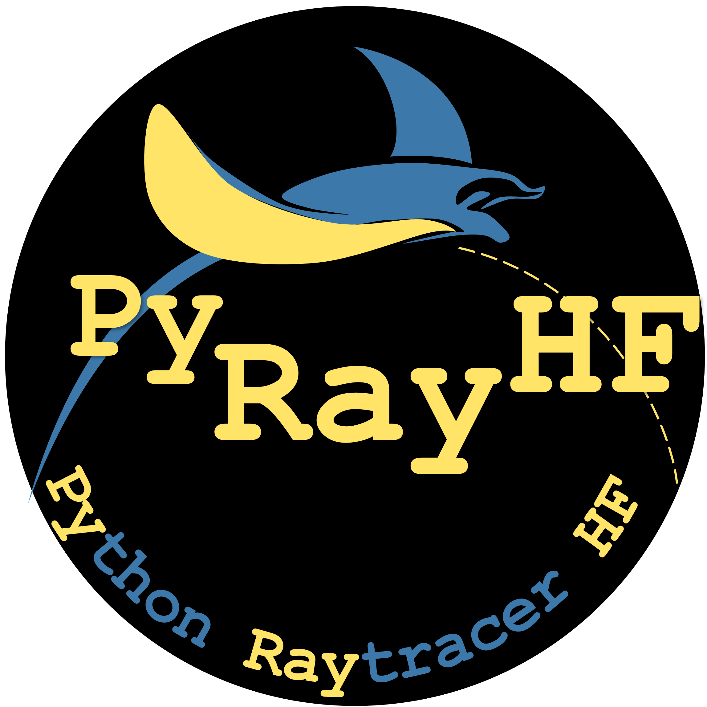

Overview
========

This library provides a set of ray-tracing solvers for modeling high-frequency radio wave propagation through the ionosphere.
Each solver applies Snell's law or its continuous differential form to compute how a ray bends, reflects, and returns to Earth as it moves through a plasma with altitude-dependent refractive index.
The Cartesian versions assume a flat Earth and are ideal for short paths or local studies, while the spherical versions include Earth's curvature for long-range and global propagation.
The library also includes vertical raytracing routines, which model straight-up propagation to determine reflection heights, critical frequencies, and plasma cutoff behavior.
Together, these functions form a coherent framework for simulating and optimizing ionospheric refraction across both simplified and realistic geometries.

